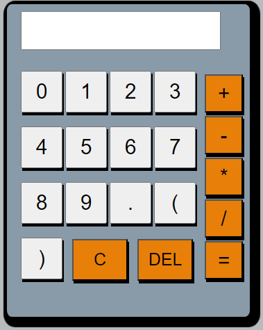
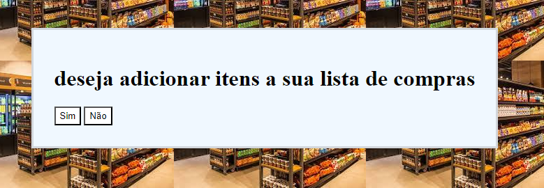
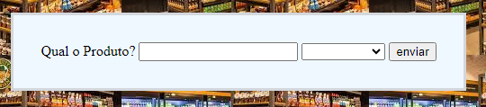
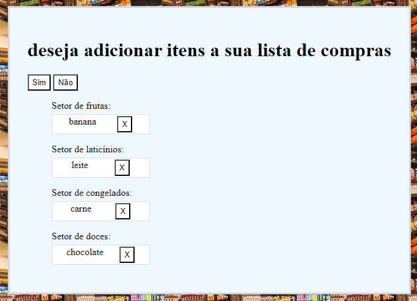

# 7 dias de desafios de lógica de programação

### Desafios diários de lógica com Javascript, onde os principais desafios são as construções de uma calculadora e um carrinho de compras

## Calculadora

### Só operações básicas com a função de apagar tudo e apagar um número

## Carrinho de compras
### Adicionar itens de compra em uma lista, exibindo eles por sua devida categoria, com a opção de apagar o item.

